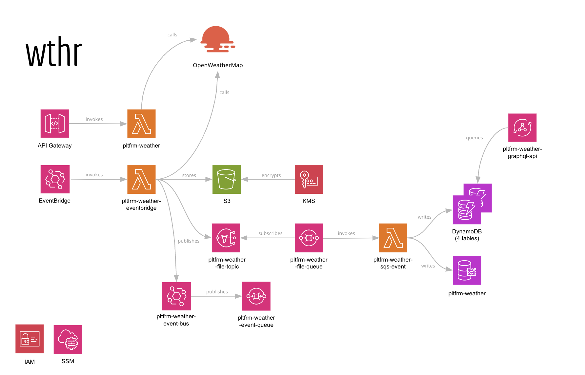

# pltfrm

Welcome to `pltfrm` : an AWS platform, designed as a portfolio, demonstration site, and a chance to explore new
technologies and ideas.

## Stage 1 : Wthr

This stage is a simple weather application, which uses the OpenWeatherMap API to retrieve weather data for a given
location - where I live. It exposes APIs to call for current and forecasted weather, and also stores data in Timestream,
AWS's time-series database, that allows me to (a) build up history, and also (b) see how forecasts can change over time.



Endpoints:

```
GET {url}/weather : text description of the weather now in Auckland.
```

### Functionality implemented

- API Gateway : to expose the API
- Lambda : to process the API requests
- Timestream : to store weather data
- DynamoDB : to store weather data
- KMS : to encrypt "sensitive" data
- CloudWatch : to log events
- SSM : to store configuration data
- EventBridge : to trigger the Lambda function
- EventBridge : to provide an EventBus (with rules
- SNS : to send notifications
- SQS : to store notifications, for processing or just to keep a record

## Front end

I have a simple React/Vite front end available to display some of the data I'm collecting.

Repository : [pltfrm-web](https://github.com/simongarton/pltfrm-web)

Site : [pltfrm-web](https://pltfrm-web.netlify.app/
)

## Software used

- Java : Corretto 17
- Lombok : for boilerplate code
- Jackson : JSON serialization/deserialization
- Log4J2 : logging library

- Squidfunk : https://github.com/squidfunk/terraform-aws-api-gateway-enable-cors


